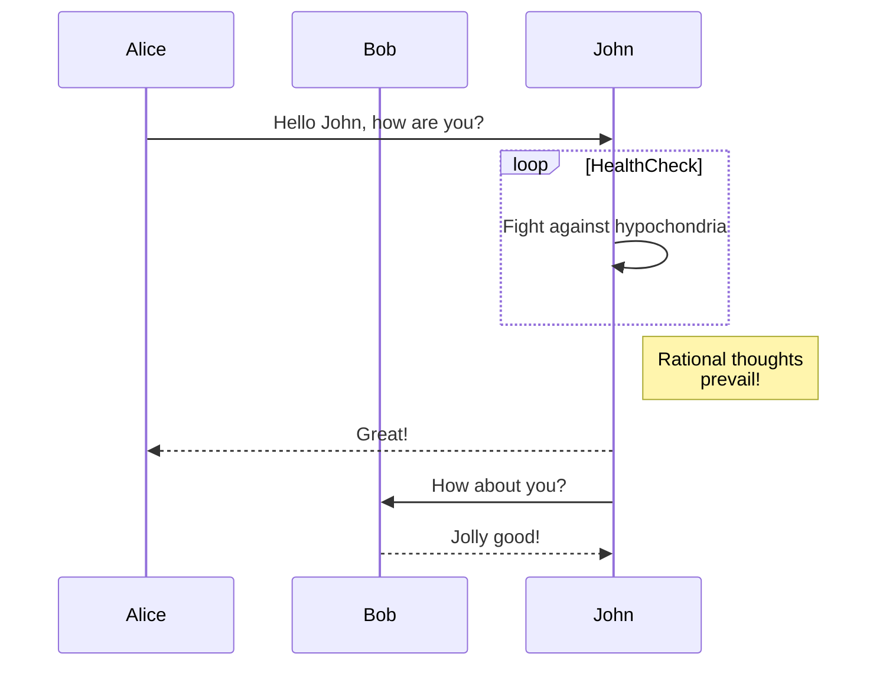
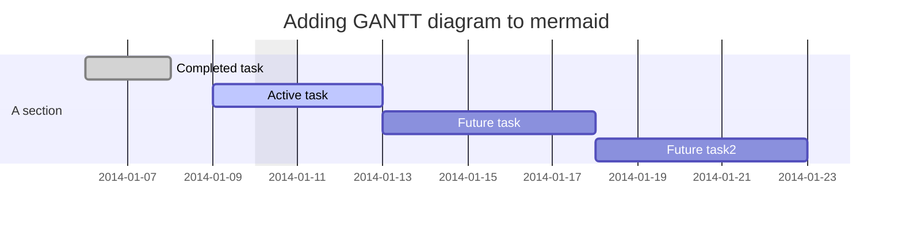
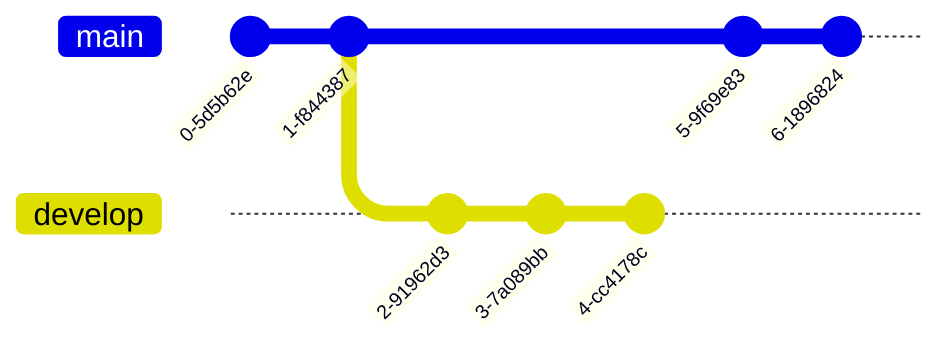

# blog

- base de données => base row
- email => zapier + gmail 
- formulaire de contact => tally en mode iframe
- site internet 
    - front office (publique)
        - python + flask
        - aws 
    - back office (pour les gestionnaires du site)
        - python + flask + aws
        - le système de formulaire de baserow
        - mode spécial pour écrire des articles depuis Notion 
- cardd
- webflow
- make.com
- calendly
- zapier
- notion
- tally 


# Base de données

3 tables :

articles 

id clé primaire
titre 
contenu
slug 
meta
dt-publication
image
categorie_id
published 

---

categories

id clé primaire
label
description

---

users

id  clé primaire
email
pseudo
password
role
dt-creation

---

relations

un article ne peut être associé qu'à une seule catégorie
un catégorie peut être associée à 1 ou plusieurs articles

---

# Arborescence (liste des pages que l'on va avoir dans le site)

front 
    - page d'accueil => présente l'ensemble des articles publiés
    - cliquer sur un article pour voir l'ensemble de son contenu
    - page de contact 
    - mention légale / RGPD
    - connexion 

Back office 
    - page d'accueil dashboard
    - espace de gestion des articles
    - espace de gestion des catégories
    - espace de gestion des users 

# Maquette visuel sur Figma
# Charte Graphique  => IA / Bootstrap 

---

# SEO 

- pour chaque page balise title 
- balise meta description
- du h1 , h2 besoin de img avec l'attribut alt
- fichiers : robots.txt / sitemap.xml
- slug 
- google analytics 
- favicon 


---

# Sécurité

- Brut Force
- injection SQL
- injection XSS
- CSRF
- injection commande
- téléchargement d'image
- Content Policy Security
- password vont être stockés en base de données avec algorithme de hashage fort 
- les informations sensibles dans le code seront stocké dans des fichiers environnement (.env) 


# Users Case / Fonctions du site


le front est accessible à l'ensemble des utilisateurs 

le back est accessible uniquement aux admins du site 
les admin du site peuvent
    - gérer les articles : créer / modifier / supprimer
    - gérer les catégories : créer / modifier / supprimer 
    - gérer les profils admins : créer / modifier / supprimer  


# Cas pratique

1. créer un nouveau workspace dans baserow (blog)
2. créer une nouvelle base de données blog
3. créer 3 tables articles / catégories / users 









```txt
articles 

id clé primaire
titre 
contenu
slug 
meta
dt-publication
image
categorie_id
published 

---

categories

id clé primaire
label
description

---

users

id  clé primaire
email
pseudo
password
role
dt-creation

---

relations

un article ne peut être associé qu'à une seule catégorie
un catégorie peut être associée à 1 ou plusieurs articles
```
